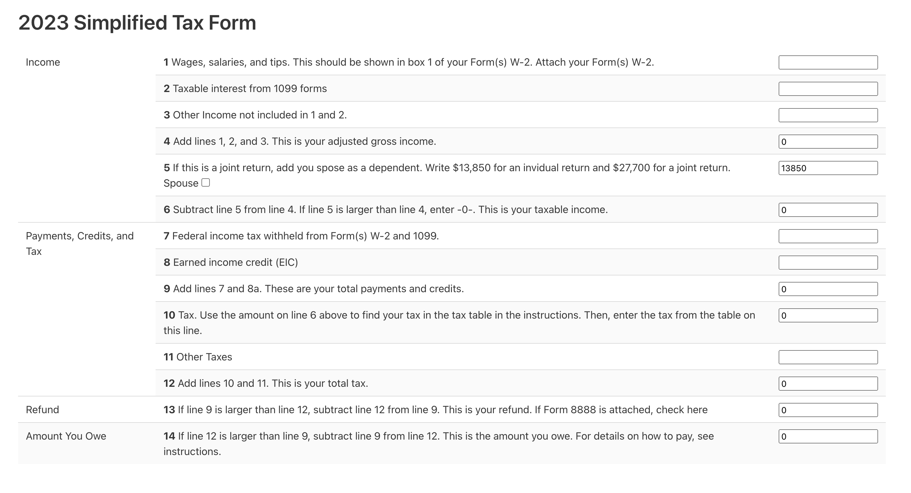

# Assignment: Creating a Tax Form

You should work in the `assignment` folder, and create in `assignment/index.html` a form that looks like the 1040EZ form.  

You should modify the files: 
- `assignment/index.html` : The main HTML file. 
- `assignment/js/index.js` : The javascript file that will compute the tax.

You should use Bulma CSS for styling, and Vue 3 for the javascript.

The form should look like this:

Based on https://www.irs.gov/pub/irs-prior/f1040ez--2016.pdf 

Use the following tax rates.  In each row, the first number is the tax rate, the second number is the lower bound of the tax bracket if filing separately, and the third number is the lower bound of the tax bracket if filing jointly.
        
    var rates = [[10, 0, 0]
                 [12, 11000, 22000],
                 [22, 44725, 89450],
                 [24, 95375, 190750],
                 [32, 182100, 364200],
                 [35, 231250, 462500],
                 [37, 578125, 693750]]

The form should have the following requirements:
- Step 01: It should consist of valid HTML and CSS (0.5 point)
- Step 02: It should use the Bulma css style and all elements must be styled accordingly. (0.5 points)
- Step 03: It should consist of a `<table>` with 3 columns and 14 rows. (0.5 point)
- Step 04: Each row should have class `row-N` where N is the row number. (1 point)
- Step 05: The first column should contain a description of the input type: Income / Payments, Credits and Tax / Refund / Amount you owe. (0.5 point)
- Step 06: The second column should contain in bold the row number, followed by a description of the row. (1 point)
- Step 07: The third column should contain an `<input>` field for the corresponding values. Each input should have name "value-N" where N is the corresponding number from the original form. (1 points)
- Step 08: Rows 4, 5, 6, 9, 10, 13, 14 should contain read-only input fields, whose value is computed via javascript. (0.5 point)
- Step 09: Row 4 should contain the total of rows 1, 2, and 3, and be updated each time a digit is entered in such rows. (1 points)
- Step 10: We modified row 5, assuming that no-one can claim either as a dependent (so no worksheet is needed). Use checkbox with name "filing-jointly" for joint filing, and update the value in row 5 accordingly. (1 point)
- Step 11 & 12: The form should compute the tax correctly using 2023 rates. (2.5 points)

## Grading

You can grade the assignment yourself, like this: 

    python grade.py

## Submission

To submit, first crete the zip file, via: 

    python zipit.py

This creates the file `submission.zip`.  Submit this file to this [Google Form](https://docs.google.com/forms/d/e/1FAIpQLSfFuYwEHasbIN395D1Wr_xYWdYd-HYf7t0rtnujjNGZLOYchw/viewform?usp=sf_link), and **be sure to press SUBMIT on the form**.  Just uploading the file to the form is not enough. 
